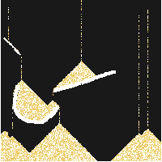

# Sand
Is this sand "simulation" thing

## Dependencies
**cmake**, **make**, **git**, **opengl**, **X11** / **Wayland**, (if you want to use the record feature, **ffmpeg**)

## Build
```bash
git clone https://github.com/tomtamtam/Sand.git
cd Sand
mkdir build && cd build
cmake ..
make
#optional:
cp compile_commands.json ../
```



## Usage
Inside the build folder run
```bash
./sand
```
Inside the window you can draw obstacles, sand-spawner, and sand directly, comparable to some app like paint. If you want to record your simulation, without using a third party tool, yout can render it into output/Recording${Date}/out.mp4/gif using the record feature. More information under **Shortcuts**. **IMPORTANT:** The Record feature is currently only avalible on Linux builds due to the ffmpeg implimentation.

## Shorcuts
- **ESC**: Reset the entire scene
- **C**: Reset all drawn obstacles

- **O**: Set draw-mode to **Obstacle**
- **P**: Set draw-mode to **Sand-Spawner**
- **S**: Set draw-mode to **Sand**
- **UP / DOWN** Adjust the draw-size

- **G**: Set recording output-format to **GIF**
- **V**: Set recording output-format to **MP4** (Video)
- **R**: Start / Stop recording
